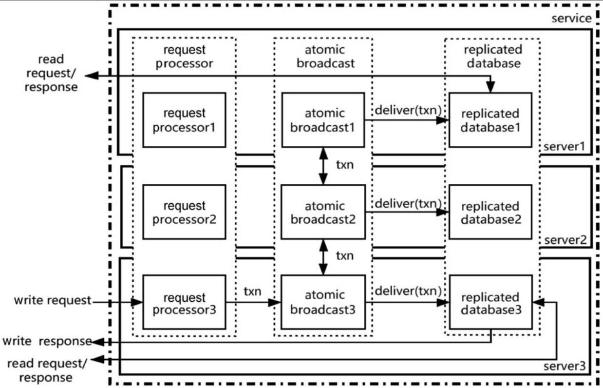

ZooKeeper是一个开源的分布式协调服务，用来协调一个分布式系统中的多个进程协同工作。
## 协调服务的应用场景
ZooKeeper主要被应用在配置管理（configuration management）、组员（group membership）、选主（leader election）、锁（lock）上。

### 1.配置管理
配置管理用来实现分布式系统中的动态配置，配置信息被存储在ZooKeeper中。当进程启动时，进程连接到ZooKeeper，从ZooKeeper中读取配置信息。ZooKeeper保持这个连接，当配置更新时，它会通知所有连接的进程配置有变化，进程可以重新读取配置信息。

### 2.组员
一个分布式集群，集群中的成员是动态变化的，集群成员信息包括：
- 有新成员加入。
- 有旧成员离开（宕机、重启）。
- 当前有哪些成员。

### 3.选主
一个分布式集群，需要选举其中一个成员作为leader，并且只有唯一一个成员被选为集群的leader，比如HBase中的master、Kafka中的partition leader和controller。

### 4.锁
锁场景与选主非常类似，在一个集群中只有一个成员能获得锁。

总结以上场景，我们可以看到在分布式系统中有多个进程存在，要想让这些进程按照预想的方式工作，必须很好地协调系统中每个进程的行为，ZooKeeper就是这个系统中的协调员。在这些进程中，谁担任master，哪些进程还活着，哪些进程已经死了，又有哪些进程加入系统，等等，都由ZooKeeper这个协调员来管理。分布式系统就像是一个动物园，每个进程都是动物园里的动物，而ZooKeeper就是动物园管理员。

## Zookeeper简述
### ZooKeeper的数据模型
ZooKeeper的数据模型类似于一个文件系统，但是ZooKeeper并不是一个文件系统，它只是使用了与文件系统类似的树形结构来管理数据。

### ZooKeeper的外部接口
- create（path，data，flags）：创建一个路径名为path的znode，znode中保存的数据是data，flags是znode的标识，这个标识包括前面讲过的regular类型、ephemeral类型、sequential属性这些信息。
- delete（path，version）：删除路径名为path的znode，如果指定version，则只有当库中的版本与version相同时才删除。
- exist（path，watch）：判断是否存在路径名为path的znode。watch参数指定是否同时创建一个watch。
- getData（path，watch）：读取路径名为path的znode中的数据。watch参数指定是否同时创建一个watch。
- setData（path，data，version）：向路径名为path的znode中写入数据data。如果指定version，则只有当库中的版本与version相同时才写入。
- getChildData（path，watch）：读取路径名为path的znode中所有子znode的名字。
- sync（path）：这个方法被调用后会一直等待，直到调用它之前的所有更新都已经复制到客户端连接的server后才返回。path未被使用。

### ZooKeeper的架构
一个ZooKeeper服务（service）由多个server组成，Zookeeper的架构如下图所示。

物理上，一个服务由多个server组成；逻辑上，一个服务由三个逻辑组件组成，即请求处理器（request processor）、原子广播（atomic broadcast）和多副本的数据库（replicated database）。每个逻辑组件在每个server中都存在。

ZooKeeper采用首要备份模式（primary backup scheme）。写请求（write request）由请求处理器处理，并且只由其中一个server上的请求处理器处理。这个处理写请求的请求处理器所在的server被称为首要（primary）进程，其他server被称为备份（backup）进程。因为只有首要进程的请求处理器处理写请求，该请求处理器可以串行依次处理所有的请求。

