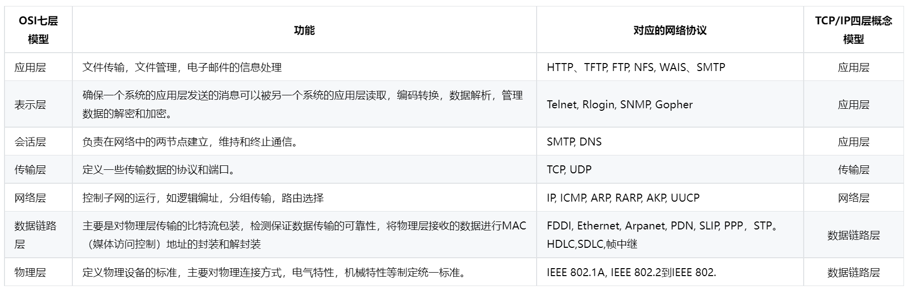
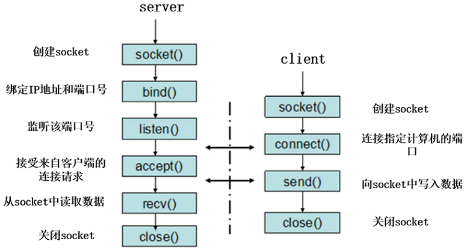

## 为什么需要三次握手跟四次挥手?
### 为什么需要三次握手?
目的：为了防止已失效的连接请求报文段突然又传送到了服务端，因而产生错误。主要防止资源的浪费。

具体过程：当客户端发出第一个连接请求报文段时并没有丢失，而是在某个网络节点出现了长时间的滞留，以至于延误了连接请求在某个时间之后才到达服务器。这应该是一个早已失效的报文段。但是服务器在收到此失效的连接请求报文段后，以为是客户端的一个新请求，于是就向客户端发出了确认报文段，同意建立连接。假设不采用三次握手，那么只要服务器发出确认后，新的连接就可以建立了。但是由于客户端没有发出建立连接的请求，因此不会管服务器的确认，也不会向服务器发送数据，但服务器却以为新的运输连接已经建立，一直在等待，所以，服务器的资源就白白浪费。
### 为什么需要四次挥手?
* 为了保证在最后断开的时候，客户端能够发送最后一个ACK报文段能够被服务器接收到。如果客户端在收到服务器给它的断开连接的请求之后，回应完服务器就直接断开连接的话，若服务器没有收到回应就无法进入CLOSE状态，所以客户端要等待两个最长报文段寿命的时间，以便于服务器没有收到请求之后重新发送请求。
* 防止“已失效的连接请求报文”出现在连接中，在释放连接的过程中会有一些无效的滞留报文，这些报文在经过2MSL的时间内就可以发送到目的地，不会滞留在网络中。这样就可以避免在下一个连接中出现上一个连接的滞留报文了。

## UDP和TCP区别
TCP:面向连接/可靠/基于字节流

UDP:无连接/不可靠/面向报文
1. TCP面向连接；UDP无连接
2. TCP可靠传输，使用流量控制和拥塞控制；UDP不可靠传输，不使用流量控制和拥塞控制
3. TCP只能是一对一通信；UDP支持一对一、一对多、多对一和多对多
4. TCP面向字节流；UDP面向报文
5. TCP首部最小20字节，最大60字节；UDP首部开销小，仅8字节
6. TCP适用于要求可靠传输的应用，例如文件传输；UDP适用于实时应用（IP电话、直播等）

## OSI七层模型
物理层、数据链路层、网络层、传输层、会话层、表示层、应用层
1. 物理层是为数据链路层提供物理连接，以透明的传送比特流；
2. 在物理层的基础上，传输以帧为单位的数据；
3. 网络层是通过执行路由选择算法，为报文分组通过通信子网选择最适当的路径；
4. 传输层是向用户提供可靠的端到端服务，透明的传送报文；
5. 会话层是组织两个回话用户之间的对话，并管理数据交换；
6. 表示层用于处理通信系统间信息交换的表示方式；
7. 应用层不仅要提供远程所需要的信息交换和远程操作，并且还要作为应用进程的用户代理，完成一些信息交换的功能。

## 简述网络七层参考模型，每一层的作用


## 请说一下socket网络编程中客户端和服务端用到哪些函数？
### 服务端函数
1. socket创建一个套接字
2. bind绑定ip和port
3. listen使套接字变为可以被动链接
4. accept等待客户端的链接
5. write/read接收发送数据
6. close关闭连接

### 客户端函数
1. 创建一个socket，用函数socket()
2. bind绑定ip和port
3. 连接服务器，用函数connect()
4. 收发数据，用函数send()和recv()，或read()和write()
5. close关闭连接



## HTTP 与 HTTPS 区别
1. HTTP明文传输，数据都是未加密的，安全性较差，HTTPS（SSL+HTTP）数据传输过程是加密的，安全性较好。
2. 使用HTTPS协议需要到 CA（Certificate Authority，数字证书认证机构） 申请证书，一般免费证书较少，因而需要一定费用。证书颁发机构如：Symantec、Comodo、GoDaddy和GlobalSign等。
3. HTTP页面响应速度比HTTPS快，主要是因为HTTP使用TCP三次握手建立连接，客户端和服务器需要交换3个包，而HTTPS除了TCP的三个包，还要加上ssl握手需要的9个包，所以一共是12个包。
4. http和https使用的是完全不同的连接方式，用的端口也不一样，前者是80，后者是443。
5. HTTPS其实就是建构在SSL/TLS之上的HTTP协议，所以，HTTPS比HTTP要更耗费服务器资源。

## http请求方法
1. get：请求指定的页面信息
2. head：类似于get只不过返回的没有具体内容
3. post：进行处理请求
4. put：从客户端向服务器传送的数据取代指定的文档的内容
5. delete：请求服务器删除指定的页面
6. connect：代理服务器
7. options：允许客户端查看服务器的性能
8. trace：显示服务器收到的请求

## 状态码
* 200-请求成功
* 301-资源被永久转移到其他url
* 404-请求的资源不存在
* 500-内部服务器错误

##  HTTP 和 HTTPS 的区别
**HTTP**：是互联网上应用最为广泛的一种网络协议，是一个客户端和服务器端请求和应答的标准（TCP），用于从WWW服务器传输超文本到本地浏览器的传输协议，它可以使浏览器更加高效，使网络传输减少。
**HTTPS**：是以安全为目标的HTTP通道，简单讲是HTTP的安全版，即HTTP下**加入SSL层**，HTTPS的安全基础是SSL，因此加密的详细内容就需要SSL。
HTTPS协议的主要作用可以分为两种：一种是**建立信息安全通道**，来保证数据传输的安全；另一种就是**确认网站的真实性**。

### HTTP与HTTPS的区别 　　
1. https协议需要到ca申请证书，一般免费证书较少，因而需要一定费用。 　　
2. http是超文本传输协议，信息是**明文传输**，https则是具有安全性的**ssl加密传输**协议。
3. http和https使用的是完全不同的连接方式，用的端口也不一样，**前者是80，后者是443**。 　　
4. http的连接很简单，是**无状态的**；HTTPS协议是由SSL+HTTP协议构建的可进行**加密传输**、**身份认证**的网络协议，比http协议安全。

## 简述静态路由和动态路由
1. 静态路由是由系统管理员设计与构建的路由表规定的路由。适用于网关数量有限的场合，且网络拓朴结构不经常变化的网络。其缺点是不能动态地适用网络状况的变化，当网络状况变化后必须由网络管理员修改路由表。
2. 动态路由是由路由选择协议而动态构建的，路由协议之间通过交换各自所拥有的路由信息实时更新路由表的内容。动态路由可以自动学习网络的拓朴结构，并更新路由表。其缺点是路由广播更新信息将占据大量的网络带宽。

## 有哪些路由协议，都是如何更新的
路由可分为静态&动态路由。静态路由由管理员手动维护；动态路由由路由协议自动维护。
路由选择算法的必要步骤：
1. 向其它路由器传递路由信息；
2. 接收其它路由器的路由信息；
3. 根据收到的路由信息计算出到每个目的网络的最优路径，并由此生成路由选择表；
4. 根据网络拓扑的变化及时的做出反应，调整路由生成新的路由选择表，同时把拓扑变化以路由 信息的形式向其它路由器宣告。
两种主要算法：**距离向量法**（Distance Vector Routing）和**链路状态算法**（Link-State Routing）。
由此可分为距离矢量（如：RIP、IGRP、EIGRP）&链路状态路由协议（如：OSPF、IS-IS）。 路由协议是路由器之间实现路由信息共享的一种机制，它允许路由器之间相互交换和维护各自的路由表。当一台路由器的路由表由于某种原因发生变化时，它需要及时地将这一变化通知与之相连接的其他路由器，以保证数据的正确传递。路由协议不承担网络上终端用户之间的数据传输任务。

1）RIP 路由协议：RIP 协议最初是为 Xerox 网络系统的 Xerox parc 通用协议而设计的，是 Internet 中常用的 路由协议。RIP 采用距离向量算法，即**路由器根据距离选择路由**，所以也称为距离向量协议。 路由器收集所有可到达目的地的不同路径，并且保存有关到达每个目的地的最少站点数的路径信息，除到达目的地的最佳路径外，任何其它信息均予以丢弃。同时路由器也把所收集的路由信息用 RIP 协议通知相邻的其它路由器。这样，正确的路由信息逐渐扩散到了全网。RIP 使用非常广泛，它简单、可靠，便于配置。但是 RIP 只适用于小型的同构网络，因为它**允许的最大站点数为15**，任何超过 15 个站点的目的地均被标记为不可达。而且 RIP 每 隔 30s 一次的路由信息广播也是造成网络的广播风暴的重要原因之一。
2）OSPF 路由协议：OSPF 是一种**基于链路状态**的路由协议，需要每个路由器向其同一管理域的所有其它路由器发送链路状态广播信息。在 OSPF 的链路状态广播中包括所有接口信息、所有的量度和其它一些变量。利用 OSPF 的路由器首先必须收集有关的链路状态信息，并**根据一定的算法计算出到每个节点的最短路径**。而基于距离向量的路由协议仅向其邻接路由器发送有关路由更新信息。与 RIP 不同，OSPF 将一个自治域再划分为区，相应地即有两种类型的路由选择方式： 当源和目的地在同一区时，采用区内路由选择；当源和目的地在不同区时，则采用区间路由选择。这就大大减少了网络开销，并增加了网络的稳定性。当一个区内的路由器出了故障时并不影响自治域内其它区路由器的正常工作，这也给网络的管理、维护带来方便。
3）BGP 和 BGP4 路由协议：BGP 是为 TCP／IP 互联网设计的外部网关协议，用于多个自治域之间。它既不是基于纯粹的链路状态算法，也不是基于纯粹的距离向量算法。它的主要功能是与其它自治域的 BGP 交换网络可达信息。**各个自治域可以运行不同的内部网关协议**。BGP 更新信息包括网络号／自治域路径的成对信息。自治域路径包括到达某个特定网络须经过的自治域串，这些更新信 息通过 TCP 传送出去，以保证传输的可靠性。为了满足 Internet 日益扩大的需要，BGP 还在不断地发展。在最新的 BGP4 中，还可以 将相似路由合并为一条路由。
4）IGRP 和 EIGRP 协议：EIGRP 和早期的 IGRP 协议都是由 Cisco 发明，是基于距离向量算法的动态路由协议。 EIGRP(Enhanced Interior Gateway Routing Protocol)是增强版的 IGRP 协议。它属于动态内部网 关路由协议，仍然使用矢量－距离算法。但它的实现比 IGRP 已经有很大改进，其收敛特性 和操作效率比 IGRP 有显著的提高。它的收敛特性是基于 DUAL ( Distributed Update Algorithm ) 算法的。DUAL 算法使得路径 在路由计算中根本不可能形成环路。它的收敛时间可以与已存在的其他任何路由协议相匹敌。
Enhanced IGRP 与其它路由选择协议之间主要区别包括：收敛宽速（Fast Convergence）、 支持变长子网掩模（Subnet Mask）、局部更新和多网络层协议。执行 Enhanced IGRP 的路由 器存储了所有其相邻路由表，以便于它能快速利用各种选择路径（Alternate Routes）。如果没有合适路径，Enhanced IGRP 查询其邻居以获取所需路径。直到找到合适路径，EnhancedIGRP 查询才会终止，否则一直持续下去。
EIGRP 不作周期性更新。取而代之，当路径度量标准改变时，Enhanced IGRP 只发送局 部更新（Partial Updates）信息。局部更新信息的传输自动受到限制，从而使得只有那些需 要信息的路由器才会更新。基于以上这两种性能，因此 Enhanced IGRP 损耗的带宽比 IGRP 少得多。

## 简述域名解析过程，本机如何干预域名解析
### 域名解析过程
1. 在浏览器中输入www.qq.com域名，操作系统会先检查自己本地的hosts文件是否有这个网址映射关系，如果有，就先调用这个IP地址映射，完成域名解析。
2. 如果hosts里没有这个域名的映射，则查找本地DNS解析器缓存，是否有这个网址映射关系，如果有，直接返回，完成域名解析。
3. 如果hosts与本地DNS解析器缓存都没有相应的网址映射关系，首先会找TCP/IP参数中设置的首选DNS服务器，在此我们叫它本地DNS服务器，此服务器收到查询时，如果要查询的域名，包含在本地配置区域资源中，则返回解析结果给客户机，完成域名解析，此解析具有权威性。
4. 如果要查询的域名，不由本地DNS服务器区域解析，但该服务器已缓存了此网址映射关系，则调用这个IP地址映射，完成域名解析，此解析不具有权威性。
5. 如果本地DNS服务器本地区域文件与缓存解析都失效，则根据本地DNS服务器的设置（是否设置转发器）进行查询，如果未用转发模式，本地DNS就把请求发至13台根DNS，根DNS服务器收到请求后会判断这个域名(.com)是谁来授权管理，并会返回一个负责该顶级域名服务器的一个IP。本地DNS服务器收到IP信息后，将会联系负责.com域的这台服务器。这台负责.com域的服务器收到请求后，如果自己无法解析，它就会找一个管理.com域的下一级DNS服务器地址(qq.com)给本地DNS服务器。当本地DNS服务器收到这个地址后，就会找qq.com域服务器，重复上面的动作，进行查询，直至找到www.qq.com主机。
6. 如果用的是转发模式，此DNS服务器就会把请求转发至上一级DNS服务器，由上一级服务器进行解析，上一级服务器如果不能解析，或找根DNS或把转请求转至上上级，以此循环。不管是本地DNS服务器用是是转发，还是根提示，最后都是把结果返回给本地DNS服务器，由此DNS服务器再返回给客户机。
从客户端到本地DNS服务器是属于**递归查询**，而DNS服务器之间就是的交互查询就是**迭代查询**。

### 本机如何干预域名解析
通过修改本机host来干预域名解析，例如：
在/etc/hosts文件中添加一句话
```
192.168.188.1 www.baidu.com
```
保存文件后再ping一下www.baidu.com就会连接到192.168.188.1了

每一行为一条记录，分成两部分，第一部分是IP，第二部分是域名。
* 一个IP后面可以跟多个域名，可以是几十个甚至上百个
* 每一行只能有一个IP，也就是说一个域名不能对应多个IP
* 如果有多行中出现相同的域名（对应的ip不一样），会按最前面的记录来解析

## 简述 DNS 查询服务器的基本流程是什么？DNS 劫持是什么？
### 基本流程
1. 打开浏览器，输入一个域名。比如输入www.163.com，这时，你使用的电脑会发出一个DNS请求到本地DNS服务器。本地DNS服务器一般都是你的网络接入服务器商提供，比如中国电信，中国移动。
2. DNS请求到达本地DNS服务器之后，本地DNS服务器会首先查询它的缓存记录，如果缓存中有此条记录，就可以直接返回结果。如果没有，本地DNS服务器还要向DNS根服务器进行查询。
3. 根DNS服务器没有记录具体的域名和IP地址的对应关系，而是告诉本地DNS服务器，你可以到域服务器上去继续查询，并给出域服务器的地址。
4. 本地DNS服务器继续向域服务器发出请求，在这个例子中，请求的对象是.com域服务器。.com域服务器收到请求之后，也不会直接返回域名和IP地址的对应关系，而是告诉本地DNS服务器，你的域名的解析服务器的地址。
5. 最后，本地DNS服务器向域名的解析服务器发出请求，这时就能收到一个域名和IP地址对应关系，本地DNS服务器不仅要把IP地址返回给用户电脑，还要把这个对应关系保存在缓存中，以备下次别的用户查询时，可以直接返回结果，加快网络访问。
### DNS 劫持
DNS劫持就是通过劫持了DNS服务器，通过某些手段取得某域名的解析记录控制权，进而修改此域名的解析结果，导致对该域名的访问由原IP地址转入到修改后的指定IP，其结果就是对特定的网址不能访问或访问的是假网址，从而实现窃取资料或者破坏原有正常服务的目的。DNS劫持通过**篡改DNS服务器上的数据返回给用户一个错误的查询结果**来实现的。
DNS劫持症状：在某些地区的用户在成功连接宽带后，首次打开任何页面都指向ISP提供的“电信互联星空”、“网通黄页广告”等内容页面。还有就是曾经出现过用户访问Google域名的时候出现了百度的网站。这些都属于DNS劫持。

## 简述网关的作用是什么，同一网段的主机如何通信
### 网关的作用
网关即网络中的关卡，我们的互联网是一个一个的局域网、城域网、等连接起来的，在连接点上就是一个一个网络的关卡，即我们的网关，他是保证网络互连的，翻译和转换，使得不同的网络体系能够进行。
### 同一网段的主机如何通信
网内通信，即通信双方都位处同一网段中，数据传输无需经过路由器(或三层交换机)，即可由本网段自主完成。

假设发送主机的ARP表中并无目的主机对应的表项，则发送主机会以目的主机IP地址为内容，广播ARP请求以期获知目的主机MAC地址，并通过交换机(除到达端口之外的所有端口发送，即洪泛(Flooding))向全网段主机转发，而只有目的主机接收到此ARP请求后会将自己的MAC地址和IP地址装入ARP应答后将其回复给发送主机，发送主机接收到此ARP应答后，从中提取目的主机的MAC地址，并在其ARP表中建立目的主机的对应表项(IP地址到MAC地址的映射)，之后即可向目的主机发送数据，将待发送数据封装成帧，并通过二层设备(如交换机)转发至本网段内的目的主机，自此完成通信。

## 简述CSRF攻击的思想以及解决方法
### CSRF
CSRF全称叫做，**跨站请求伪造**。就是黑客可以伪造用户的身份去做一些操作，进而满足自身目的。
要完成一次CSRF攻击，受害者必须依次完成两个步骤：
1. 登录受信任网站A，并在本地生成Cookie。
2. 在不登出A的情况下，访问危险网站B。
此时，黑客就可以获取你的cookie达成不可告人的目的了。
### 解决方法
CSRF 攻击是一种请求伪造的攻击方式，它利用的是服务器不能识别用户的类型从而盗取用户的信息来攻击。因此要防御该种攻击，因为从服务器端着手，增强服务器的识别能力，设计良好的防御机制。主要有以下几种方式：
1. 请求头中的Referer验证（不推荐）
HTTP的头部有一个Referer信息的字段，它记录着该次HTTP请求的来源地址（即它从哪里来的）,既然CSRF攻击是伪造请求是从服务器发送过来的，那么我们就**禁止跨域访问**，在服务器端增加验证，**过滤掉那些不是从本服务器发出的请求**，这样可以在一定程度上避免CSRF攻击。 但是这也有缺点，比如如果是从搜索引擎所搜结果调整过来，请求也会被认为是跨域请求。
2. 请求令牌验证（**token验证**）
token验证是一种比较广泛使用的防止CSRF攻击的手段，当用户通过**正常渠道访问服务器时**，**服务器会生成一个随机的字符串保存在session中**，并作为**令牌（token）**返回给客户端，以隐藏的形式保存在客户端中，客户端每次请求都会带着这个token，服务器根据该token判断该请求是否合法。

## MAC地址和IP地址分别有什么作用
1. IP地址是IP协议提供的一种统一的地址格式，它为互联网上的每一个网络和每一台主机分配一个逻辑地址，以此来屏蔽物理地址的差异。而MAC地址，指的是物理地址，用来定义网络设备的位置。
2. IP地址的分配是根据网络的拓扑结构，而不是根据谁制造了网络设置。若将高效的路由选择方案建立在设备制造商的基础上而不是网络所处的拓朴位置基础上，这种方案是不可行的。
3. 当存在一个附加层的地址寻址时，设备更易于移动和维修。例如，如果一个以太网卡坏了，可以被更换，而无须取得一个新的IP地址。如果一个IP主机从一个网络移到另一个网络，可以给它一个新的IP地址，而无须换一个新的网卡。
4. 无论是局域网，还是广域网中的计算机之间的通信，最终都表现为将数据包从某种形式的链路上的初始节点出发，从一个节点传递到另一个节点，最终传送到目的节点。数据包在这些节点之间的移动都是由ARP（Address Resolution Protocol：地址解析协议）负责将IP地址映射到MAC地址上来完成的。

## 简述 TCP 三次握手和四次挥手的过程
### 三次握手
1）第一次握手：建立连接时，客户端向服务器发送SYN包（seq=x），请求建立连接，等待确认

2）第二次握手：服务端收到客户端的SYN包，回一个ACK包（ACK=x+1）确认收到，同时发送一个SYN包（seq=y）给客户端

3）第三次握手：客户端收到SYN+ACK包，再回一个ACK包（ACK=y+1）告诉服务端已经收到

4）三次握手完成，成功建立连接，开始传输数据

### 四次挥手
1）客户端发送FIN包（FIN=1）给服务端，告诉它自己的数据已经发送完毕，请求终止连接，此时客户端不发送数据，但还能接收数据

2）服务端收到FIN包，回一个ACK包给客户端告诉它已经收到包了，此时还没有断开socket连接，而是等待剩下的数据传输完毕

3）服务端等待数据传输完毕后，向客户端发送FIN包，表明可以断开连接

4）客户端收到后，回一个ACK包表明确认收到，等待一段时间，确保服务端不再有数据发过来，然后彻底断开连接

## TCP 如何保证有序
主机每次发送数据时，TCP就给每个数据包分配一个序列号并且在一个特定的时间内等待接收主机对分配的这个序列号进行确认，如果发送主机在一个特定时间内没有收到接收主机的确认，则发送主机会重传此数据包。接收主机利用序列号对接收的数据进行确认，以便检测对方发送的数据是否有丢失或者乱序等，接收主机一旦收到已经顺序化的数据，它就将这些数据按正确的顺序重组成数据流并传递到高层进行处理。

具体步骤如下：

（1）为了保证数据包的可靠传递，发送方必须把已发送的数据包保留在缓冲区；

（2）并为每个已发送的数据包启动一个超时定时器；

（3）如在定时器超时之前收到了对方发来的应答信息（可能是对本包的应答，也可以是对本包后续包的应答），则释放该数据包占用的缓冲区;

（4）否则，重传该数据包，直到收到应答或重传次数超过规定的最大次数为止。

（5）接收方收到数据包后，先进行CRC校验，如果正确则把数据交给上层协议，然后给发送方发送一个累计应答包，表明该数据已收到，如果接收方正好也有数据要发给发送方，应答包也可方在数据包中捎带过去。

## TCP 超时重传
TCP可靠性中最重要的一个机制是处理数据超时和重传。TCP协议要求在发送端每发送一个报文段，就启动一个定时器并等待确认信息；接收端成功接收新数据后返回确认信息。若在定时器超时前数据未能被确认，TCP就认为报文段中的数据已丢失或损坏，需要对报文段中的数据重新组织和重传。

## TCP 可靠性保证
TCP主要提供了检验和、序列号/确认应答、超时重传、最大消息长度、滑动窗口控制等方法实现了可靠性传输。

1. 检验和
通过检验和的方式，接收端可以检测出来数据是否有差错和异常，假如有差错就会直接丢弃TCP段，重新发送。TCP在计算检验和时，会在TCP首部加上一个12字节的伪首部。检验和总共计算3部分：TCP首部、TCP数据、TCP伪首部。

2. 序列号/确认应答
- 这个机制类似于问答的形式。比如在课堂上老师会问你“明白了吗？”，假如你没有隔一段时间没有回应或者你说不明白，那么老师就会重新讲一遍。其实计算机的确认应答机制也是一样的，发送端发送信息给接收端，接收端会回应一个包，这个包就是应答包。
- 上述过程中，只要发送端有一个包传输，接收端没有回应确认包（ACK包），都会重发。或者接收端的应答包，发送端没有收到也会重发数据。这就可以保证数据的完整性。

3. 超时重传
* 超时重传是指发送出去的数据包到接收到确认包之间的时间，如果超过了这个时间会被认为是丢包了，需要重传。该如何确认这个时间值呢？

- 我们知道，一来一回的时间总是差不多的，都会有一个类似于平均值的概念。比如发送一个包到接收端收到这个包一共是0.5s，然后接收端回发一个确认包给发送端也要0.5s，这样的两个时间就是RTT（往返时间）。然后可能由于网络原因的问题，时间会有偏差，称为抖动（方差）。

+ 超时重传的时间大概是比往返时间+抖动值还要稍大的时间。

+ 但是在重发的过程中，假如一个包经过多次的重发也没有收到对端的确认包，那么就会认为接收端异常，强制关闭连接。并且通知应用通信异常强行终止。

4. 最大消息长度
- 在建立TCP连接的时候，双方约定一个最大的长度（MSS）作为发送的单位，重传的时候也是以这个单位来进行重传。理想的情况下是该长度的数据刚好不被网络层分块。

5. 滑动窗口控制
- 滑动窗口解决超时重传的机制存在效率低下的问题，不用等待确认包就发送下一个数据包。

- 窗口的大小就是在无需等待确认包的情况下，发送端还能发送的最大数据量。这个机制的实现就是使用了大量的缓冲区，通过对多个段进行确认应答的功能。通过下一次的确认包可以判断接收端是否已经接收到了数据，如果已经接收了就从缓冲区里面删除数据。

- 在窗口之外的数据就是还未发送的和对端已经收到的数据。

- 接收端在没有收到自己所期望的序列号数据之前，会对之前的数据进行重复确认。

6. 拥塞控制
- 窗口控制解决了两台主机之间因传送速率而可能引起的丢包问题，在一方面保证了TCP数据传送的可靠性。然而如果网络非常拥堵，此时再发送数据就会加重网络负担，那么发送的数据段很可能超过了最大生存时间也没有到达接收方，就会产生丢包问题。
- TCP引入慢启动机制，先发出少量数据，就像探路一样，先摸清当前的网络拥堵状态后，再决定按照多大的速度传送数据。
- 发送开始时定义拥塞窗口大小为1；每次收到一个ACK应答，拥塞窗口加1；而在每次发送数据时，发送窗口取拥塞窗口与接送段接收窗口最小者。
- **慢启动**：在启动初期以**指数增长**方式增长；设置一个慢启动的阈值，当以指数增长达到阈值时就停止指数增长，按照**线性增长**方式增加至拥塞窗口；线性增长达到网络拥塞时立即把拥塞窗口置回1，进行新一轮的“慢启动”，同时新一轮的阈值变为原来的一半。

## HTTP1.x 和 HTTP2.0 的区别是什么？
HTTP1.x和HTTP2.0主要的区别主要有以下四点： 
- 二进制格式（Binary Format）：HTTP1.x的解析是**基于文本**，但是基于文本协议的格式解析存在天然缺陷。文本的表现形式应该具有多样性，要做到健壮性考虑的场景必然很多，二进制则不同，只认0和1的组合。基于这种考虑HTTP2.0的协议解析决定采用**二进制格式**，实现方便且健壮。 
- **多路复用（MultiPlexing）**：**连接共享**，每一个请求都是是用作连接共享机制的。一个请求对应一个id，这样**一个连接上可以有多个请求**，每个连接的请求可以随机的混杂在一起，接收方可以根据请求的 id将请求再归属到各自不同的服务端请求里面。 
- **头部压缩**：HTTP1.x的头部带有大量信息，而且每次都要重复发送，HTTP2.0**使用encoder来减少需要传输的头部大小**，通讯双方各自缓存一份头部表，既避免了重复头部的传输，又减小了需要传输的大小。 
- 服务端推送（server push）：如果请求了index.html文件，服务器端会主动将它的依赖文件一起返回。

## TCP 常见的拥塞控制算法有哪些
1. TCP Tahoe/Reno

最初的实现，包括慢启动、拥塞避免两个部分。基于重传超时（retransmission timeout/RTO）和重复确认为条件判断是否发生了丢包。两者的区别在于：Tahoe算法下如果收到三次重复确认，就进入快重传立即重发丢失的数据包，同时将慢启动阈值设置为当前拥塞窗口的一半，将拥塞窗口设置为1MSS，进入慢启动状态；而Reno算法如果收到三次重复确认，就进入快重传，但不进入慢启动状态，而是直接将拥塞窗口减半，进入拥塞控制阶段，这称为“快恢复”。

而Tahoe和Reno算法在出现RTO时的措施一致，都是将拥塞窗口降为1个MSS，然后进入慢启动阶段。

2. TCP BBR（Bottleneck Bandwidth and Round-trip propagation time）

BBR是由Google设计，于2016年发布的拥塞算法。以往大部分拥塞算法是基于丢包来作为降低传输速率的信号，而BBR则基于模型主动探测。该算法使用网络最近出站数据分组当时的最大带宽和往返时间来建立网络的显式模型。数据包传输的每个累积或选择性确认用于生成记录在数据包传输过程和确认返回期间的时间内所传送数据量的采样率。该算法认为随着网络接口控制器逐渐进入千兆速度时，分组丢失不应该被认为是识别拥塞的主要决定因素，所以基于模型的拥塞控制算法能有更高的吞吐量和更低的延迟，可以用BBR来替代其他流行的拥塞算法，例如CUBIC。

## 说说 HTTP 的方法有哪些
- GET： 用于请求访问已经被URI（统一资源标识符）识别的资源，可以通过URL传参给服务器
- POST：用于传输信息给服务器，主要功能与GET方法类似，但一般推荐使用POST方式。
- PUT： 传输文件，报文主体中包含文件内容，保存到对应URI位置。
- HEAD： 获得报文首部，与GET方法类似，只是不返回报文主体，一般用于验证URI是否有效。
- DELETE：删除文件，与PUT方法相反，删除对应URI位置的文件。
- OPTIONS：查询相应URI支持的HTTP方法。

## 简述 HTTP 1.0，1.1，2.0 的主要区别
http/1.0 :

1. 默认不支持长连接，需要设置keep-alive参数指定
2. 强缓存expired、协商缓存last-modified\if-modified-since 有一定的缺陷

http 1.1 :

1. 默认长连接(keep-alive)，http请求可以复用Tcp连接，但是同一时间只能对应一个http请求(http请求在一个Tcp中是串行的)
2. 增加了强缓存cache-control、协商缓存etag\if-none-match 是对http/1 缓存的优化

http/2.0 :

1. 多路复用，一个Tcp中多个http请求是并行的 (雪碧图、多域名散列等优化手段http/2中将变得多余)
2. 二进制格式编码传输
3. 使用HPACK算法做header压缩
4. 服务端推送

## 说说 HTTP 常见的响应状态码及其含义
- 1XX : 信息类状态码（表示接收请求状态处理）
- 2XX : 成功状态码（表示请求正常处理完毕）
- 3XX : 重定向（表示需要进行附加操作，已完成请求）
- 4XX : 客户端错误（表示服务器无法处理请求）
- 5XX : 服务器错误状态码（表示服务器处理请求的时候出错）

- 200 : 从状态码发出的请求被服务器正常处理。
- 204 : 服务器接收的请求已成功处理，但在返回的响应报文中不含实体的主体部分【即没有内容】。
- 206 : 部分的内容（如：客户端进行了范围请求，但是服务器成功执行了这部分的干请求）。
- 301 : 跳转，代表永久性重定向（请求的资源已被分配了新的URI，以后已使用资源，现在设置了URI）。
- 302 : 临时性重定向（请求的资源已经分配了新的URI，希望用户本次能够使用新的URI来进行访问）。
- 303 : 由于请求对应的资源存在的另一个URI（因使用get方法，定向获取请求的资源）。
- 304 : 客户端发送附带条件的请求时，服务器端允许请求访问资源，但因发生请求未满足条件的情况后，直接返回了 304。
- 307 : 临时重定向【该状态码与302有着相同的含义】。
- 400 : 请求报文中存在语法错误（当错误方式时，需修改请求的内容后，再次发送请求）。
- 401 : 发送的请求需要有通过HTTP认证的认证信息。
- 403 : 对请求资源的访问被服务器拒绝了。
- 404 : 服务器上无法找到请求的资源。
- 500 : 服务器端在执行请求时发生了错误。
- 503 : 服务器暂时处于超负载或者是正在进行停机维护，现在无法处理请求。

## 说说 GET请求和 POST 请求的区别
1. GET请求在URL中传送的参数是有长度限制的，而POST没有。

2. GET比POST更不安全，因为参数直接暴露在URL上，所以不能用来传递敏感信息。

3. GET参数通过URL传递，POST放在Request body中。

4. GET请求参数会被完整保留在浏览器历史记录里，而POST中的参数不会被保留。

5. GET请求只能进行url编码，而POST支持多种编码方式。

6. GET请求会被浏览器主动cache，而POST不会，除非手动设置。

7. GET产生的URL地址可以被Bookmark，而POST不可以。

8. GET在浏览器回退时是无害的，而POST会再次提交请求。

## 说说 Cookie 和 Session 的关系和区别是什么
1. Cookie与Session都是会话的一种方式。它们的典型使用场景比如“购物车”，当你点击下单按钮时，服务端并不清楚具体用户的具体操作，为了标识并跟踪该用户，了解购物车中有几样物品，服务端通过为该用户创建Cookie/Session来获取这些信息。

2. cookie数据存放在客户的浏览器上，session数据放在服务器上。

3. cookie不是很安全，别人可以分析存放在本地的COOKIE并进行COOKIE欺骗 考虑到安全应当使用session。

4. session会在一定时间内保存在服务器上。当访问增多，会比较占用你服务器的性能 考虑到减轻服务器性能方面，应当使用COOKIE。

5. 单个cookie保存的数据不能超过4K，很多浏览器都限制一个站点最多保存20个cookie。

## 简述 HTTPS 的加密与认证过程
1. 客户端在浏览器中输入一个https网址，然后连接到server的443端口 采用https协议的server必须有一套数字证书（一套公钥和密钥） 首先server将证书（公钥）传送到客户端；客户端解析证书，验证成功，则生成一个随机数（私钥），并用证书将该随机数加密后传回server；server用密钥解密后，获得这个随机值，然后将要传输的信息和私钥通过某种算法混合在一起（加密）传到客户端；客户端用之前的生成的随机数（私钥）解密服务器端传来的信息。

2. 首先浏览器会从内置的证书列表中索引，找到服务器下发证书对应的机构，如果没有找到，此时就会提示用户该证书是不是由权威机构颁发，是不可信任的。如果查到了对应的机构，则取出该机构颁发的公钥。用机构的证书公钥解密得到证书的内容和证书签名，内容包括网站的网址、网站的公钥、证书的有效期等。浏览器会先验证证书签名的合法性。签名通过后，浏览器验证证书记录的网址是否和当前网址是一致的，不一致会提示用户。如果网址一致会检查证书有效期，证书过期了也会提示用户。这些都通过认证时，浏览器就可以安全使用证书中的网站公钥了。

## UDP如何实现可靠传输
UDP不属于连接协议，具有资源消耗少，处理速度快的优点，所以通常音频，视频和普通数据在传送时，使用UDP较多，因为即使丢失少量的包，也不会对接受结果产生较大的影响。

传输层无法保证数据的可靠传输，只能通过应用层来实现了。实现的方式可以参照tcp可靠性传输的方式，只是实现不在传输层，实现转移到了应用层。

最简单的方式是在应用层模仿传输层TCP的可靠性传输。下面不考虑拥塞处理，可靠UDP的简单设计。

1. 添加**seq/ack机制**，确保数据发送到对端
2. 添加**发送和接收缓冲区**，主要是用户超时重传。
3. 添加**超时重传机制**。

详细说明：送端发送数据时，生成一个随机seq=x，然后每一片按照数据大小分配seq。数据到达接收端后接收端放入缓存，并发送一个ack=x的包，表示对方已经收到了数据。发送端收到了ack包后，删除缓冲区对应的数据。时间到后，定时任务检查是否需要重传数据。

目前有如下开源程序利用udp实现了可靠的数据传输。分别为 RUDP、RTP、UDT。

开源程序

1、RUDP（Reliable User Datagram Protocol）
RUDP 提供一组数据服务质量增强机制，如拥塞控制的改进、重发机制及淡化服务器算法等 ，从而在包丢失和网络拥塞的情况下， RTP 客户机（实时位置）面前呈现的就是一个高质量的 RTP 流。在不干扰协议的实时特性的同时，可靠 UDP 的拥塞控制机制允许 TCP 方式下的流控制行为。

2、RTP（Real Time Protocol）
RTP为数据提供了具有实时特征的端对端传送服务，如在组播或单播网络服务下的交互式视频音频或模拟数据。

应用程序通常在 UDP 上运行 RTP 以便使用其多路结点和校验服务；这两种协议都提供了传输层协议的功能。但是 RTP 可以与其它适合的底层网络或传输协议一起使用。如果底层网络提供组播方式，那么 RTP 可以使用该组播表传输数据到多个目的地。

RTP 本身并没有提供按时发送机制或其它服务质量（QoS）保证，它依赖于底层服务去实现这一过程。RTP 并不保证传送或防止无序传送，也不确定底层网络的可靠性。RTP 实行有序传送， RTP 中的序列号允许接收方重组发送方的包序列，同时序列号也能用于决定适当的包位置，例如：在视频解码中，就不需要顺序解码。

3、UDT（UDP-based Data Transfer Protocol）
基于UDP的数据传输协议（UDP-basedData Transfer Protocol，简称UDT）是一种互联网数据传输协议。*UDT的主要目的是支持高速广域网上的海量数据传输*，而互联网上的标准数据传输协议TCP在高带宽长距离网络上性能很差。

顾名思义，UDT建于UDP之上，并引入新的拥塞控制和数据可靠性控制机制。UDT是面向连接的双向的应用层协议。它同时支持可靠的数据流传输和部分可靠的数据报传输。由于UDT完全在UDP上实现，它也可以应用在除了高速数据传输之外的其它应用领域，例如点到点技术（P2P），防火墙穿透，多媒体数据传输等等。

