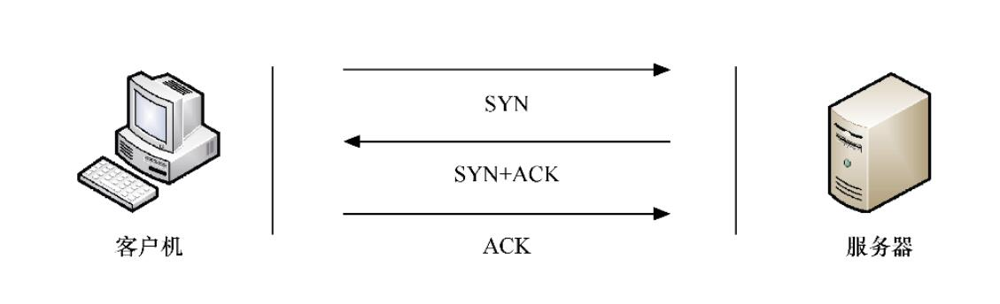

# 拒绝服务攻击的相关理论
服务器所面临的最大威胁当数拒绝服务攻击，拒绝服务攻击其实是一类攻击的合称。所有这种类型的攻击的目的都是相同的，那就是要是使受攻击的服务器系统瘫痪或服务失效，从而使合法用户无法得到相应的资源。

而传输层常用的协议只有TCP和UDP两种。因此攻击者只需要研究这两个协议的缺陷，就几乎可以实现对所有类型服务器的攻击。

目前已经出现了很多种类型的拒绝服务攻击方式，我们只挑选其中最为典型的两种SYN flooding攻击和UDP flooding攻击进行讲解。其中SYN flooding攻击是针对TCP协议的，它的主要目的是占用目标上所有可用的连接请求。而UDP flooding攻击则是针对UDP协议的，主要目的是耗尽目标所在网络的带宽。

## TCP连接的建立方式
TCP协议在进行通信之前需要先建立连接，例如一个客户机和一个服务器之间在发送实际的数据之前，会互相向对方发送控制数据包。这个过程使得客户机和服务器都进入连接状态，然后就可以进行数据交换了，我们称其为3次握手。握手过程一旦完成，客户机和服务器之间就建立好了一个连接，因此我们在描述TCP协议时会说这是一个面向连接的协议。

## SYN flooding攻击
这种攻击最早出现于1996年，当时大量的网站服务器都遭受到了这种SYN flooding攻击。这种攻击利用了TCP连接的3次握手，但是这个握手过程是建立在理想状态下的，而在实际状态下当服务器收到了来自客户端发送的SYN请求之后，会发出一个SYN-ACK回应，是连接进入到了半开状态，但是这个回应很有可能会因为网络问题无法达到客户端。所以此时需要给这个半开的连接设置一个计时器，如果计时完成了还没有收到客户端的ACK回应，就会重新发送SYN-ACK消息，直到超过一定次数之后才会释放连接。服务器需要为每一个半开连接分配一定的系统资源，所以当出现数量众多的半开连接时，服务器就会因为资源耗尽，进而停止对所有连接请求的响应。

所以攻击者可以向服务器发送大量的SYN请求但是不响应SYN-ACK回应，甚至直接伪造SYN请求的源地址，这样服务器发回的SYN-ACK回应也不会得到任何的回应。这就是SYN flooding攻击。

### 解决SYN Flooding拒绝服务攻击
1. **丢弃第一个SYN数据包**：这种方法最为简单，就是当服务器对收到SYN数据包的地址进行记录，丢弃从某个IP地址发来的第一个SYN数据包。因为攻击者在进行攻击的时候，往往只会发送一个SYN数据包之后就没有后续动作了，而如果这个IP地址真的希望和服务器建立连接的话，一定会再次发送SYN数据包过来。但是这样做的缺陷也很明显，由于每次都需要发送两次SYN数据包才能建立连接，从而导致用户的体验非常差。

2. **反向探测**：这种方法就是向SYN数据包的源地址发送探测包，然后再根据源地址的反应来判断数据包的合法性。 

3. **代理模式**：就是把防火墙作为代理，然后由防火墙代替服务器和客户机建立连接。当双向连接建立成功之后，再进行数据的转发。这样一来就可以拦截企图要发起SYN Flooding攻击的客户机。

### UDP协议
虽然与TCP一样位于传输层，UDP协议却不需要建立连接就可以传输数据，而且少了很多的控制机制，因而传输速度高于TCP协议，所以也得到了广泛的使用。

UDP是一个设计极为简洁的协议，控制选项较少，因此在数据传输过程中延迟小、数据传输效率高，这也是当前最为热门的通信工具QQ选用了UDP作为传输层协议的重要原因。

UDP协议封装时所添加的内容主要包括源端口、目的端口、长度和校验码4个部分。

1. Source Port表示这个数据包的源端口，大小为2 字节，当不需要对方回应时，可以全部为0。

2. Destination Port表示目的端口号，大小为2字节。

3. Length表示长度，大小为2 字节，表示UDP报文的长度。

4. Checksum表示校验码，接收方以此来判断传输中是否有错。

不过，UDP协议也面临着一个和TCP协议一样的威胁，那就是泛洪攻击。不过不同于TCP协议占用服务器连接数的方式，UDP协议因为不需要建立连接，所以攻击者将目标转向了带宽，他们构造大量体积巨大的UDP数据包并发往目标，从而导致目标网络的瘫痪。

## UDP Flooding攻击
UDP是一个无连接的传输层协议，所以在数据传输过程，不需要建立连接和进行认证。攻击者只需要向目标发送大量巨大的UDP数据包，就会使目标所在的网络资源被耗尽。

攻击者使用源IP欺骗的方法向有漏洞的UDP服务器发送伪造请求。UDP服务器不知道请求是伪造的，于是礼貌地准备响应。当成千上万的响应被传递给一个不知情的目标主机时，这个攻击问题就会发生。

## 防御UDP Flooding攻击
目前，防火墙是防御UDP Flooding的主要设备，而它主要采用限流和指纹学习两种方式来实现防御。限流方式简单直接，就是设法将链路中的UDP报文控制在合理的带宽范围内。

**限流的三种方式**：
1. 基于目的IP地址的限流，可以对去往“192.168.1.102”的UDP数据包进行统计并限流，如果超过了指定值，则将后来的UDP报文丢弃。

2. 基于目的安全区域的限流，即以某个安全区域作为统计对象，对到达这个安全区域的UDP流量进行统计并限流，超过部分丢弃。而安全区域（Security Zone），也称为区域（Zone），是一个逻辑概念，用于管理防火墙设备上安全需求相同的多个接口，也就是说它是一个或多个接口的集合。

3. 基于会话的限流，即对每条UDP会话上的报文速率进行统计，如果会话上的UDP报文速率达到了告警阈值，这条会话就会被锁定，后续命中这条会话的UDP报文都被丢弃。当这条会话连续3秒或者3秒以上没有流量时，防火墙会解锁该会话，后续命中该会话的报文可以继续通过。

**指纹学习方式**：
指纹学习是通过分析UDP报文中的数据内容来判断它是否异常。防火墙首先会对发往某个服务器的UDP报文进行统计，当达到指定阈值时，就会开始进行指纹学习。如果这些报文携带的数据具有相同特征，就会被学习成指纹。后续的报文如果具有与此指纹相匹配的特征就会被当成攻击报文而丢弃。

目前，指纹学习功能是针对UDPFlooding攻击的主流防御手段，在华为防火墙产品中得到了广泛应用。

